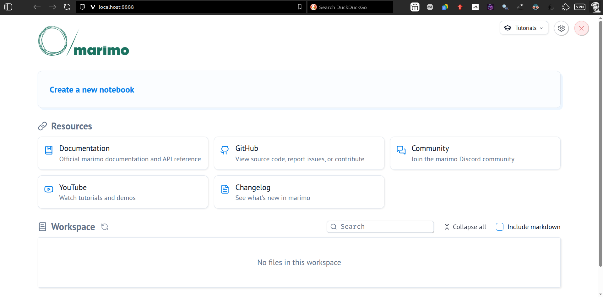



```{r setup, include=FALSE}
source('_setup.R')
#library(reticulate)
#use_virtualenv('../.venv')
```


# Sobre este documento

Este documento foi gerado usando Quarto^[Quarto: <https://quarto.org/>.], a partir do arquivo fonte <https://github.com/fnaufel/sagres-marimo/blob/master/010-sagres.qmd> (salvo em um repositório público no Github).

A maneira mais fácil de ver o fonte que gerou este documento é clicando no *link* `</> Código`, no alto desta página, à direita.

Caso você tenha perguntas, correções ou sugestões sobre o conteúdo deste documento, entre em contato por *e-mail* ou abra um *issue* no repositório do Github.


# Objetivos

- [Apresentar o supercomputador Escola de Sagres]{.hl}.
- Explicar como [usar o Escola de Sagres remotamente, via SSH]{.hl}.
- Explicar como [usar Python no Escola de Sagres]{.hl}, com [acesso remoto a *notebooks* marimo]{.hl} (via navegador).


# O supercomputador Escola de Sagres

O supercomputador Escola de Sagres é um computador de alto desempenho situado no Instituto Politécnico, no *campus* regional da UERJ em Nova Friburgo, conectado
a redes internacionais de pesquisa.

O supercomputador Escola de Sagres possui

- Pico de performance teórica (Rpeak) de 4,6 trilhões de operações de ponto flutuante por segundo (TFLOPS);
- Computação paralela (IA) de 72 trilhões de operações de ponto flutuante por segundo (TFLOPS);
- 128 núcleos;
- 256 threads;
- 2560 núcleos CUDA;
- 1024 GB de RAM;
- 1440 GB de SSD SATA;
- 3840 GB de SSD NVMe; e
- 112 TB de HDD.

Além do nó de *login*, o sistema consiste de 

- Dois nós CPU (`bartolomeu-dias` e `vasco-da-gama`); e
- Um nó GPU (`pedro-alvares-cabral`) com duas GPU NVIDIA A2 16GB GDDR6 PCIe.

Todos os nós rodam o sistema operacional Rocky Linux^[Rocky Linux: <https://rockylinux.org>.].

Para o gerenciamento de *jobs*, é usado o Slurm^[Slurm: <https://slurm.schedmd.com/overview.html>.].

Mais informações sobre o Escola de Sagres, em português, estão nos *links* abaixo:

- [Ficha técnica](https://docs.google.com/document/d/1zd4JEPxoMiMSn1drD0dTPm5LX0HT8dhjUOIfu3_b5-s);
- [Tutoriais e exemplos](https://drive.google.com/drive/folders/1S4_EyoJ1SZ_OLKs1hDHHL_Sbv3MpMdGE).

::: {.callout-note title="Como ter acesso ao Escola de Sagres"}

Preencha o formulário de solicitação de uso em <http://www.bit.ly/sagresHPC>.

:::


# Acesso remoto via ssh {#sec-ssh}

É possível acessar o Escola de Sagres via terminal, usando *Secure Shell Protocol* [@barrett05:_ssh]. Nesta seção, explicaremos como fazer isto.

## Linux {#sec-ssh-linux}

O comando `ssh`^[`ssh` *man page*: <https://www.man7.org/linux/man-pages/man1/ssh.1.html>.] já vem instalado no Linux. Execute, no *shell*,

```{bash}
ssh -i /caminho/para/chave/privada -p 5522 nome.usuario@179.106.49.41
```
   
substituindo `/caminho/para/chave/privada` pelo caminho para o arquivo de chave privada que você recebeu quando abriu a sua conta no Escola de Sagres e substituindo `nome.usuario` pelo seu nome de usuário.

Se tudo der certo, você estará no *prompt* de um *shell* no nó de *login*. Se necessário, entre a senha que você recebeu quando abriu a sua conta no Escola de Sagres.

É possível salvar as configurações do `ssh` no arquivo `~/.ssh/config` de maneira a simplificar o comando de acesso.

Adicione ao arquivo `~/.ssh/config` as seguintes linhas (substituindo `/caminho/para/chave/privada` pelo caminho para o arquivo de chave privada que você recebeu quando abriu a sua conta no Escola de Sagres e substituindo `nome.usuario` pelo seu nome de usuário):

```{bash}
Host sagres
    HostName 179.106.49.41
    User nome.usuario
    Port 5522
    IdentityFile /caminho/para/chave/privada
    IdentitiesOnly yes
    
Host bartolomeu-dias vasco-da-gama pedro-alvares-cabral
    User nome.usuario
    IdentityFile /caminho/para/chave/privada
    IdentitiesOnly yes
    ProxyJump sagres
```

Depois de salvar o arquivo, você pode se conectar ao Escola de Sagres digitando apenas

```{bash}
ssh sagres
```

no seu *shell*. Além disso, você pode se conectar via SSH com os outros três nós do Escola de Sagres, usando o nome do nó desejado.


## Windows {#sec-ssh-win}

É preciso ter um cliente SSH instalado no seu computador. No Windows, você pode instalar um dos seguintes programas (ou outro semelhante):

- PuTTY^[PuTTY: <https://www.ssh.com/academy/ssh/putty/download>.].
- MobaXterm^[MobaXterm: <https://mobaxterm.mobatek.net/download.html>.].
   
Configure o seu cliente SSH do seguinte modo:

   - Endereço do *host*: 179.106.49.41;
   - Porta: 5522;
   - No campo adequado, entre seu nome de usuário;
   - No campo adequado, escolha usar chave privada;
   - No campo adequado, entre o caminho do arquivo de chave privada que você recebeu quando abriu a sua conta no Escola de Sagres.

Se tudo der certo, você estará no *prompt* de um *shell* no nó de *login*. Se necessário, entre a senha que você recebeu quando abriu a sua conta no Escola de Sagres.


# *Notebooks* marimo

Marimo^[marimo: <https://docs.marimo.io>] é um *notebook* para Python, semelhante a (mas mais avançado que) Jupyter.

Marimo oferece os seguintes recursos:

- Tudo necessário, em um só lugar: substitui `jupyter`, `streamlit`, `jupytext`, `ipywidgets`, `papermill` e outras ferramentas do ecossistema;

- Reatividade de verdade: ao executar uma célula, o marimo [atualiza automaticamente todas as células dependentes](https://docs.marimo.io/guides/reactivity/) ou [as sinaliza como desatualizadas](https://docs.marimo.io/#expensive-notebooks), conforme o caso. Isto evita o **problema do estado oculto**, comum em *notebooks* jupyter quando as células são executadas fora de ordem;

- Interatividade nativa: conecta [sliders, tabelas, gráficos e outros componentes](https://docs.marimo.io/guides/interactivity/) diretamente ao Python — sem precisar escrever *callbacks*;

- Amigabilidade ao Git: *notebooks* são salvos como arquivos `.py`, facilitando versionamento, revisão e colaboração;

- Acesso a e visualização de dados: permite consultar *dataframes*, bancos de dados, data *warehouses* e *lakehouses* [com SQL](https://docs.marimo.io/guides/working_with_data/sql/), além de [filtrar e pesquisar *dataframes*](https://docs.marimo.io/guides/working_with_data/dataframes/) com praticidade;

- Integração de IA ao fluxo de trabalho: [permite gerar células com IA](https://docs.marimo.io/guides/generate_with_ai/), com foco em tarefas de análise e manipulação de dados;

- Reprodutibilidade por padrão: [sem estado oculto](https://docs.marimo.io/guides/reactivity/), com execução determinística e [gerenciamento de pacotes embutido](https://docs.marimo.io/guides/editor_features/package_management/);

- Executabilidade como *script*: permite rodar o *notebook* [como um *script* Python](https://docs.marimo.io/guides/scripts/), inclusive com parâmetros passados por linha de comando;

- Facilidade de compartilhamento: permite publicação do *notebook* como [aplicativo *web* interativo](https://docs.marimo.io/guides/apps/) ou como [*slides*](https://docs.marimo.io/guides/apps/#slides-layout), e até [como aplicativo executável no navegador via WASM](https://docs.marimo.io/guides/wasm/);

- Reutilização de código: [permite importar funções e classes](https://docs.marimo.io/guides/reusing_functions/) de um *notebook* para outro sem atrito;

- Testabilidade: permite aplicar [`pytest` aos *notebooks*](https://docs.marimo.io/guides/testing/) e incorporar testes ao fluxo de desenvolvimento;

- Uso em editores modernos: suporta [GitHub Copilot](https://docs.marimo.io/guides/editor_features/ai_completion/#github-copilot), [assistentes de IA](https://docs.marimo.io/guides/editor_features/ai_completion/), [atalhos do vim](https://docs.marimo.io/guides/editor_features/overview/#vim-keybindings), exploradores de variáveis e [outros recursos](https://docs.marimo.io/guides/editor_features/);

- Uso em outros IDEs: pode ser usado no [VS Code ou Cursor](https://marketplace.visualstudio.com/items?itemName=marimo-team.vscode-marimo), ou no neovim, Zed, [ou qualquer outro editor de texto](https://docs.marimo.io/guides/editor_features/watching/).

Para aprender mais sobre o marimo, visite

- O [*site*](https://docs.marimo.io);
- Esta [*playlist* no YouTube](https://www.youtube.com/watch?v=3N6lInzq5MI&list=PLNJXGo8e1XT9jP7gPbRdm1XwloZVFvLEq);
- A [galeria de exemplos de *notebooks*](https://marimo.io/gallery).


# Acesso remoto a marimo via navegador

Nesta seção, vamos fazer o seguinte:

1. Conectar ao nó de *login*;
1. Verificar/escolher uma versão de Python;
1. Instalar o gerenciador de pacotes e projetos `uv`^[uv: <https://docs.astral.sh/uv/>] para Python;
1. Criar um projeto Python usando `uv`, com um ambiente virtual;
1. Instalar o marimo no ambiente do projeto.
1. Executar marimo sem o navegador.
1. Acessar o marimo no seu computador local.


## Conectar ao nó de *login*

Conecte ao Escola de Sagres usando um dos métodos descritos na @sec-ssh.


## Escolher a versão de Python

Para verificar se Python 3 está disponível, entre no terminal do Escola de Sagres:

```{bash}
which python3
```

Se a resposta for vazia, Python 3 não está disponível no seu *path*. Busque ajuda.

Para verificar a versão de Python 3 disponível, entre no terminal do Escola de Sagres:

```{bash}
python3 --version
```

O resultado é algo como

```
Python 3.8.17
```

Mas não vamos usar esta versão de Python, pois provavelmente não é a mesma versão que está instalada nos nós de *compute* (lembre-se de que você está conectado ao nó de *login*).

Em vez disto, vamos usar o sistema de módulos.

Para ver qual módulo de Python existe, entre no terminal do Escola de Sagres:

```{bash}
module spider python
```

O retorno será algo como

```
------------------------------------------
  python: python/3.12.1-gcc-8.5.0-hpdejov
------------------------------------------

    This module can be loaded directly: module load python/3.12.1-gcc-8.5.0-hpdejov

    Help:
      Name   : python
      Version: 3.12.1
      Target : zen
      
      The Python programming language.
```

(Se a resposta disser que não existe módulo `python`, busque ajuda.)

Perceba que esta versão de Python é diferente da que obtivemos com `python3 --version`.

Para usarmos esta versão, basta entrar no terminal do Escola de Sagres:

```{bash}
module load python
```

Para verificar quais módulos estão carregados no momento, entre no terminal do Escola de Sagres:

```{bash}
module list
```

A resposta será algo como

```
Currently Loaded Modules:
  1) glibc/2.28-gcc-8.5.0-3kybixu         13) libxml2/2.13.4-gcc-8.5.0-53aexux
  2) gcc-runtime/8.5.0-gcc-8.5.0-u6ywdr3  14) pigz/2.8-gcc-8.5.0-a3fzchp
  3) bzip2/1.0.8-gcc-8.5.0-scsing2        15) zstd/1.5.6-gcc-8.5.0-ylwnc6f
  4) libmd/1.0.4-gcc-8.5.0-mbjmqa2        16) tar/1.34-gcc-8.5.0-pbjuzbl
  5) libbsd/0.12.2-gcc-8.5.0-4rawvvs      17) gettext/0.22.5-gcc-8.5.0-by6lzz5
  6) expat/2.6.4-gcc-8.5.0-e2bqgj2        18) libffi/3.4.6-gcc-8.5.0-zmbj6fg
  7) ncurses/6.5-gcc-8.5.0-iuumtdh        19) libxcrypt/4.4.35-gcc-8.5.0-v22hqf6
  8) readline/8.2-gcc-8.5.0-drw3mna       20) openssl/3.4.0-gcc-8.5.0-qudabsy
  9) gdbm/1.23-gcc-8.5.0-34yh2wr          21) sqlite/3.46.0-gcc-8.5.0-4t3pqq7
 10) libiconv/1.17-gcc-8.5.0-xyzcimc      22) util-linux-uuid/2.40.2-gcc-8.5.0-ayorkts
 11) xz/5.4.6-gcc-8.5.0-jzfknv7           23) python/3.12.1-gcc-8.5.0-hpdejov
 12) zlib-ng/2.2.1-gcc-8.5.0-5btjbct
```

## Instalar `uv`

Entre no terminal do Escola de Sagres:

```{bash}
curl -LsSf https://astral.sh/uv/install.sh | sh
```

Este comando instalará `uv` em `~/.local/bin`. Verifique com

```{bash}
which uv && uv --version
```

A resposta deve ser algo como

```
~/.local/bin/uv
uv 0.10.8
```

::: {.callout-note title="Atenção"}

Você só precisa instalar o `uv` no seu diretório HOME uma vez.

:::


## Criar um projeto Python

Para criar um projeto em um novo diretório chamado `exemplo`, entre

```{bash}
uv init exemplo
```

Vá para o diretório:

```{bash}
cd exemplo
```

Digite `ls -a` para ver os arquivos criados:

```
.  ..  .git  .gitignore  .python-version  README.md  main.py  pyproject.toml
```

O arquivo `pyproject.toml` é o mais importante. Nele, ficam armazenadas as informações sobre o projeto. Seu conteúdo inicial é algo como

```
[project]
name = "exemplo"
version = "0.1.0"
description = "Add your description here"
readme = "README.md"
requires-python = ">=3.12"
dependencies = []
```

Você pode --- e deve --- editar o arquivo para preencher a descrição do projeto.

Perceba que também foi criado um repositório do git.

Para mais detalhes sobre a criação de projetos com `uv`, veja a [documentação](https://docs.astral.sh/uv/guides/projects/).


## Instalar marimo no ambiente do projeto

Digite

```{bash}
uv add marimo
```

O início da saída é algo como

```
Using CPython 3.12.1 interpreter at: /opt/software/spack/opt/spack/linux-rocky8-zen/gcc-8.5.0/python-3.12.1-hpdejovpk4m4whx64iaa2zvawfamn4jg/bin/python3.12
Creating virtual environment at: .venv
```

Perceba que um ambiente virtual foi criado.

Se você verificar o conteúdo de `pyproject.toml`, verá que foi adicionada a informação

```
dependencies = [
    "marimo>=0.20.4",
]
```

::: {.callout-note title="Por que várias instalações do marimo?"}

Como estamos usando um ambiente virtual exclusivo do projeto, precisamos instalar o marimo em cada novo projeto. 

Isto não usa tanta memória assim, e o `uv` tem um *cache* de pacotes instalados, o que faz com que instalações subsequentes sejam rápidas.

Isto também permite que projetos diferentes usem versões diferentes do marimo, evitando problemas de desatualização.

Caso deseje instalar o marimo uma única vez, de maneira que esteja disponível para todos os projetos, veja a [documentação do uv sobre *tools*](https://docs.astral.sh/uv/concepts/tools/), [mas isto não é recomendável]{.hl}.

:::

Agora falta apenas ativar o ambiente virtual:

```{bash}
source .venv/bin/activate
```

O *prompt* deve mudar, com o nome do ambiente virtual `(exemplo)` no início da linha.


## Executar marimo sem o navegador

Você ainda está no nó de *login*. O ideal é rodar o marimo em um nó de *compute*, principalmente se você quiser usar mais recursos.

O primeiro passo é usar o Slurm para rodar um *shell* em outro nó (aqui, o Bartolomeu Dias):

```{bash}
srun --partition=cpu --nodelist=bartolomeu-dias --pty bash
```

O novo *prompt* mostra que você está em outro nó (mas ainda no mesmo diretório e no mesmo ambiente virtual).

Agora você pode rodar o marimo. Aqui, usamos a porta 8888. Se esta porta estiver ocupada, escolha outra:

```{bash}
marimo edit --host 127.0.0.1 --port 8888
```

O resultado será algo como

```
Create or edit notebooks in your browser 📝

➜  URL: http://localhost:8888?access_token=hK7h4aZkRqJvuVwKFXY9QQ
```

O terminal ficará bloqueado enquanto o marimo estiver executando.


## Acessar o marimo no seu computador local

### Linux

Agora passe para um *shell* no seu computador local.

Vamos supor que seu arquivo `~/.ssh/config` tem o conteúdo descrito no final da @sec-ssh-linux.

O seguinte comando cria a conexão desejada, mapeando a porta remota onde está o marimo (no nó `bartolomeu-dias`) para a porta local do seu computador:

```{bash}
ssh -N -L 8888:localhost:8888 bartolomeu-dias
```

O *shell* ficará bloqueado.


### Windows {#sec-tunneling-win}

???


### Navegador

Agora, basta acessar, no seu navegador, o URL especificado na mensagem que o marimo emitiu quando foi iniciado (neste exemplo, `http://localhost:8888?access_token=hK7h4aZkRqJvuVwKFXY9QQ`).

Você deve ver a tela inicial do marimo:




## Recapitulação dos passos

- No seu computador:

  - Se estiver no Linux:

    ```{bash}
    ssh sagres
    ```
  
  - Se estiver no Windows, seguir as instruções na @sec-ssh-win.

- No nó de *login*:

  - Carregar o Python:

    ```{bash}
    module load python
    ```

  - Se quiser criar um novo projeto:

    ```{bash}
    uv init exemplo
    cd exemplo
    uv add marimo
    source .venv/bin/activate
    ```

  - Se quiser trabalhar em um projeto já existente:

    ```{bash}
    cd exemplo
    source .venv/bin/activate
    ```

  - Para ir para um *shell* em um nó de *compute* (e.g., `bartolomeu-dias`):

    ```{bash}
    srun --partition=cpu --nodelist=bartolomeu-dias --pty bash
    ```

- No nó de compute:

  - Rodar marimo na porta 8888:
  
    ```{bash}
    marimo edit --host 127.0.0.1 --port 8888
    ```
  
- No seu computador:

  - Se estiver no Linux:

    Criar conexão SSH, mapeando as portas:
  
    ```{bash}
    ssh -N -L 8888:localhost:8888 bartolomeu-dias
    ```
    
  - Se estiver no Windows, seguir as instruções na @sec-tunneling-win.
  
  - Acessar, no seu navegador, o URL especificado pelo marimo.

::: {.callout-note title="Atenção"}

Se a conexão entre seu computador e o marimo ficar ociosa muito tempo, ela pode ser desfeita. Neste caso, aparecerá uma mensagem de erro no seu navegador. Para restabelecer a conexão, basta 

- Executar novamente, no seu computador local, o comando para conectar via SSH, mapeando as portas; e
- Recarregar a página no navegador.

:::


# Referências {.unnumbered}

::: {#refs}
:::

